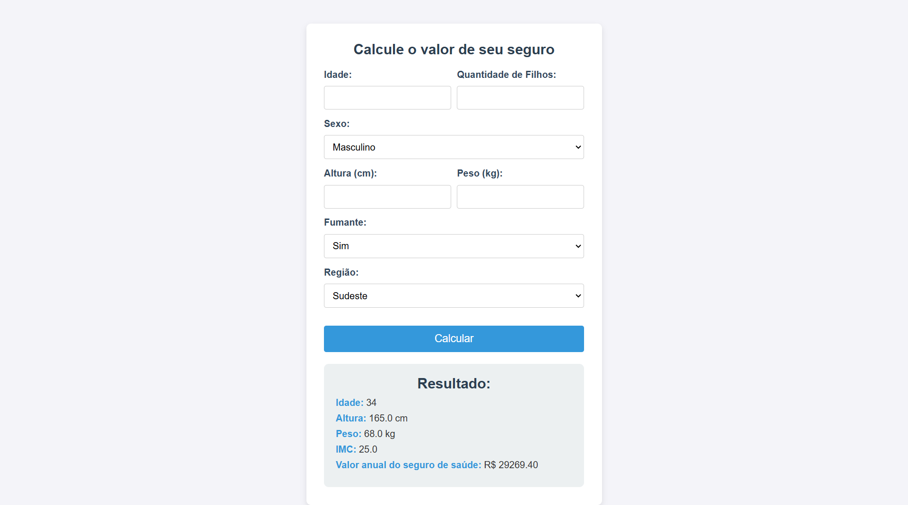

# Machine Learning Models – ECMD

**Descrição:** Esse repositório contém 3 modelos de machine learning concebidos através da ferramente no-code Knime, e 1 modelo concebido em Python. Eles foram desenvolvidos como atividades práticas da Unidade 2 da disciplina Extração do Conhecimento com Mineração de Dados, do curso de Ciência da Computação 2024.2.

**Description:** This repository contains three machine learning models created using the no-code tool KNIME and one model implemented in Python. They were developed as practical activities for Unit 2 of the Knowledge Extraction with Data Mining course, Computer Science 2024.2.

---

## Componentes / Components
- Modelo do Knime 1: Classificação Categórica de Peso (Naive Bayes e SVM)
- Modelo do Knime 2: Classificação de Preços de Celulares (Random Forest e KNN)
- Modelo do Knime 3: Regressão de Idades de Caranguejos (Random Forest Regressor)
- Modelo do Python: Regressão de Valores de Seguros de Saúde (Regressão Linear)
<br>

**EN:**
- Knime Model 1: Weight Category Classification (Naive Bayes and SVM)
- Knime Model 2: Phone Price Classification (Random Forest and KNN)
- Knime Model 3: Crab Age Regression (Random Forest Regressor)
- Python Model: Health Insurance Price Regression (Linear Regression)
<br>

**DATASETS:**
- [Obesity Classification Dataset](https://www.kaggle.com/datasets/sujithmandala/obesity-classification-dataset)
- [Mobile Price Classification](https://www.kaggle.com/datasets/iabhishekofficial/mobile-price-classification)
- [Crab Age Prediction](https://www.kaggle.com/datasets/sidhus/crab-age-prediction)
- [Medical Cost Personal Datasets](https://www.kaggle.com/datasets/mirichoi0218/insurance)


---

## How to run

#### Modelos do Knime / Knime models:
**1.** Baixe o modelo desejado; estão disponibilizados os formatos .knwf e .model / Download the desired model; available formats: .knwf and .model

**2.** Abra o workflow no Knime ou aplique o .model da maneira que desejar / Open the workflow in Knime or apply the .model as you wish.
<br>

#### Modelo do Python / Python model:
##### Google Colab / IDE:
**1.** Baixe o notebook e abra no Google Colab ou IDE escolhida / Download the notebook and open in Google Colab or your chosen IDE.
<br>

**2.** Baixe o dataset referente ao notebook e insira o caminho certo na célula de importação / Download the dataset referring to the notebook and insert the path to it into the dataset import cell.
<br>

**3.** Para rodar em uma IDE: instale os requerimentos / For running in IDE: install the requirements.
````
pip install -r requirements.txt
````

#### Deploy do Modelo do Python / Python Model Deploy:
**Render link:** 
https://deploy-flask-render-3763.onrender.com/
<br>

**Ngrok link:** 
https://5f42-2804-18-7890-233-58ad-b279-344-d9b6.ngrok-free.app
<br>

---

## Captura de tela / Screenshot



---

## Credits

**Authors:** Beatriz Almeida de Souza Silva, José Nichollas Leandro
<br>

**Professor:** Ricardo Roberto de Lima